# MLOps Platform Architecture: Scalable Model Training & Inference on Databricks

> **Design for**: 10,000 models · 750M-record inference per model · < 24-hour SLA
> **Platform**: Databricks Lakehouse · Unity Catalog · Delta Lake · MLflow
> **Author**: System Design Case Study

---

## Executive Summary

This document presents an end-to-end MLOps platform architecture built on the **Databricks Lakehouse Platform** to train 10,000 machine learning models and run batch inference across 7.5 trillion total record-model predictions within a 24-hour window. The design leverages Delta Lake for ACID-compliant data storage, Unity Catalog for governance, MLflow for experiment tracking and model registry, and Databricks Workflows for orchestration — delivering a unified, cost-efficient, and auditable ML lifecycle.

Databricks provides two complementary distributed compute engines as first-class citizens: **Apache Spark** for large-scale data engineering, and **Ray** for distributed AI workloads. Rather than choosing one over the other, this architecture uses each where it naturally excels — Spark for data processing (ingestion, transformations, SQL, feature pipelines) and Ray for AI-specific computation (distributed hyperparameter tuning, model training orchestration, and stateful batch inference). Both engines share the same cluster infrastructure, governance layer, and storage — there is no separate infrastructure to manage.

### Key Design Principles

| Principle | Implementation |
|---|---|
| **Unified Platform** | Single Databricks workspace — Spark, Ray, MLflow, Unity Catalog, Delta Lake all managed together |
| **Medallion Architecture** | Bronze → Silver → Gold data layers for progressive refinement |
| **Feature Reuse** | Databricks Feature Store (Unity Catalog) for train-serve consistency |
| **Elastic Compute** | Auto-scaling clusters with spot instances for cost optimization |
| **Zero-Copy Governance** | Unity Catalog for lineage, access control, and audit without data duplication |
| **Reproducibility** | Delta Lake time travel + MLflow experiment tracking for full provenance |

### Scale Requirements Summary

| Metric | Value | Implication |
|---|---|---|
| Models | 10,000 | Parameterized training with parallel job orchestration |
| Training records/model | < 10M | Moderate per-model; massive in aggregate |
| Raw features | 3,000+ | Requires scalable feature engineering pipelines |
| Transformed features | 25,000–30,000 | Feature selection critical for inference speed |
| Inference records/model | 750M | Distributed scoring with stateful model actors |
| Total inference predictions | **7.5 trillion** | ~86.8M predictions/second sustained throughput |
| Inference SLA | < 24 hours | Requires ~4,000–6,000 cores sustained |

---

## 1. Architecture & Components

### High-Level Architecture

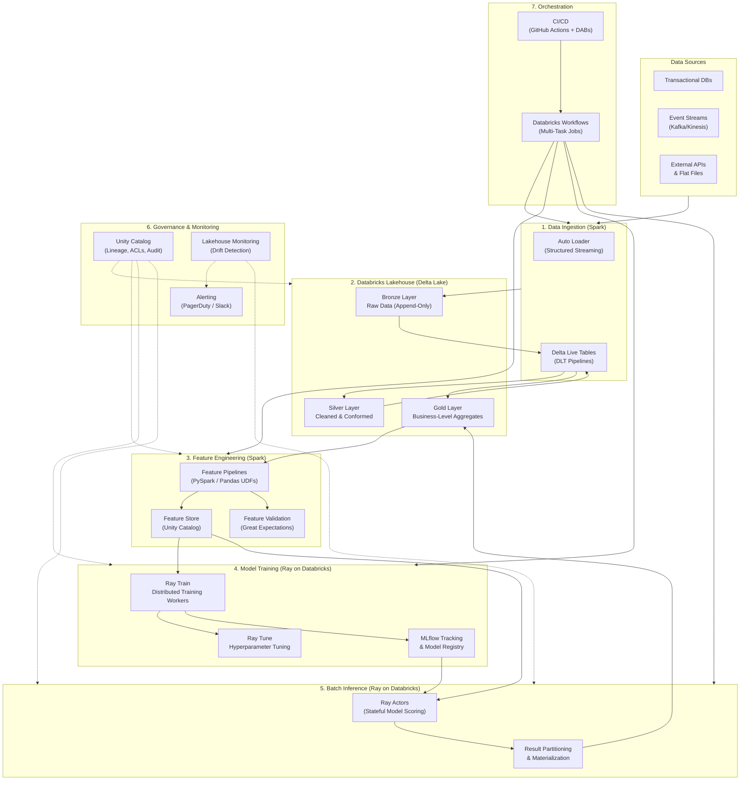

### Spark & Ray: Two Engines, One Platform

Databricks natively supports both Spark and Ray on the same cluster infrastructure via `ray.util.spark.setup_ray_cluster()`. There is no separate Ray cluster to provision — Ray workers run on Spark executor nodes, sharing the same instance pools, auto-scaling policies, and cluster policies. This is the same way Databricks offers Spark and SQL — two engines managed under one platform.

The decision of which engine to use for each stage follows naturally from what each engine was designed for:

| Stage | Engine | Why It's the Natural Fit |
|---|---|---|
| **Data Ingestion** | Spark | Auto Loader, DLT, structured streaming — Spark's core competency |
| **Medallion Architecture** | Spark | Delta Lake is Spark-native; ACID transactions, Z-ordering, time travel |
| **Feature Engineering** | Spark | Wide-table columnar processing, PySpark ML Pipelines, Photon engine |
| **Feature Store** | Spark | Unity Catalog Feature Store — point-in-time lookups, lineage tracking |
| **Hyperparameter Tuning** | Ray | Ray Tune — ASHA, PBT, Bayesian optimisation, distributed search |
| **Model Training Orchestration** | Ray | Ray Train — Python-native, dynamic resource allocation, checkpointing |
| **Batch Inference** | Ray | Ray Actors — stateful model hosting, no repeated deserialisation |
| **Monitoring & Drift** | Spark | Lakehouse Monitoring queries Delta Lake tables — a data analysis workload |
| **Governance** | Unity Catalog | Engine-agnostic — governs all data and models regardless of compute engine |
| **Orchestration** | Databricks Workflows | Engine-agnostic — orchestrates Spark tasks, Ray tasks, notebooks, SQL |

Data engineering workloads (ingestion, transformation, aggregation, SQL) are naturally distributed DataFrame operations — this is what Spark was built for. AI workloads (hyperparameter search, training coordination, stateful model inference) are naturally Python-native distributed compute problems — this is what Ray was built for. Databricks provides both under one roof.

---

### 1a. Data Ingestion & Feature Engineering

#### Data Ingestion Pipeline

**Raw data processing** uses the Databricks **Medallion Architecture** (Bronze → Silver → Gold):

```mermaid
flowchart LR
    subgraph Bronze["Bronze (Raw)"]
        direction TB
        B1["Schema-on-read"]
        B2["Append-only ingestion"]
        B3["Full audit trail"]
    end

    subgraph Silver["Silver (Cleaned)"]
        direction TB
        S1["Schema enforcement"]
        S2["Deduplication"]
        S3["Type casting & nulls"]
        S4["Referential integrity"]
    end

    subgraph Gold["Gold (Business)"]
        direction TB
        G1["Aggregated features"]
        G2["Join-enriched tables"]
        G3["Business metrics"]
    end

    Bronze -->|"Delta Live Tables<br/>Expectations & Quality Rules"| Silver
    Silver -->|"Transformation<br/>& Aggregation"| Gold
```

| Layer | Purpose | Format | Retention |
|---|---|---|---|
| **Bronze** | Raw ingestion, schema-on-read, full audit trail | Delta Lake (append-only) | 90 days + archive to cold storage |
| **Silver** | Cleaned, deduplicated, conformed, type-enforced | Delta Lake (merge/upsert) | 1 year |
| **Gold** | Business-level aggregates, feature-ready tables | Delta Lake (overwrite partitions) | Current + 3 versions (time travel) |

**Ingestion Mechanisms:**

- **Auto Loader** (Structured Streaming): For cloud storage file arrival (CSV, JSON, Parquet). Handles schema evolution, exactly-once semantics, and file notification mode for cost efficiency.
- **Delta Live Tables (DLT)**: Declarative ETL pipelines with built-in data quality expectations. Each transformation step declares quality constraints (`EXPECT`, `EXPECT OR DROP`, `EXPECT OR FAIL`).
- **JDBC/Spark Connectors**: For relational database CDC via Debezium → Kafka → Auto Loader, or direct JDBC pulls for smaller sources.

#### Feature Engineering

**The Feature Challenge**: 3,000+ raw features transforming into 25,000–30,000+ engineered features requires careful architecture to avoid:
- Training-serving skew (different transform logic at train vs. inference)
- Computational explosion at inference time (30K features × 750M records)
- Memory pressure from wide DataFrames

**Feature Engineering Pipeline Architecture:**

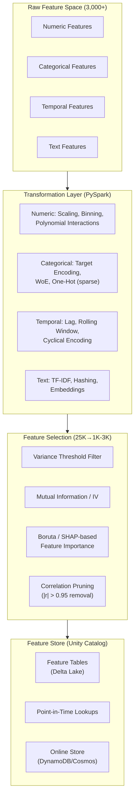

**Key Design Decisions:**

1. **Feature Transformation as Spark Pipelines**: All feature transforms implemented as PySpark `Transformer` classes within `spark.ml.Pipeline`. Same logic at training and inference — eliminates training-serving skew.

2. **Two-Phase Feature Strategy**:
   - **Phase 1 — Broad Transformation**: Generate all 25K–30K features using PySpark on Silver/Gold data. Computed once, stored in the Feature Store.
   - **Phase 2 — Model-Specific Selection**: Each model config specifies its feature subset (1,000–3,000 features). Selection uses mutual information, SHAP importance, or variance thresholds.

3. **Feature Store (Databricks/Unity Catalog Feature Store)**: Features are registered as Delta tables with point-in-time correct lookups, online store sync (DynamoDB/Cosmos DB), and full lineage tracking. Any downstream model can look up features by entity key and timestamp — no custom joins needed.

4. **Sparse Representation**: Categorical one-hot expansions stored as SparseVectors — 10–50× memory reduction for high-cardinality features.

5. **Incremental Feature Computation**: Delta Lake `MERGE` and change data feed (CDF) allow incremental recomputation — only new or changed records are processed, reducing daily compute by 80–90%.

**Feature engineering stays on Spark** because this is fundamentally a distributed DataFrame problem: wide-table columnar transforms, predicate pushdown, Z-ordering, partition pruning, and the Photon vectorised engine all deliver order-of-magnitude performance advantages over alternatives for this workload shape.

---

### 1b. Model Training Framework

Training 10,000 models with hyperparameter optimisation is a **distributed AI orchestration** problem — coordinating thousands of independent Python training jobs, each with its own resource requirements, search space, and checkpointing needs. This is where Databricks' native Ray support is the natural fit.

#### Training Architecture

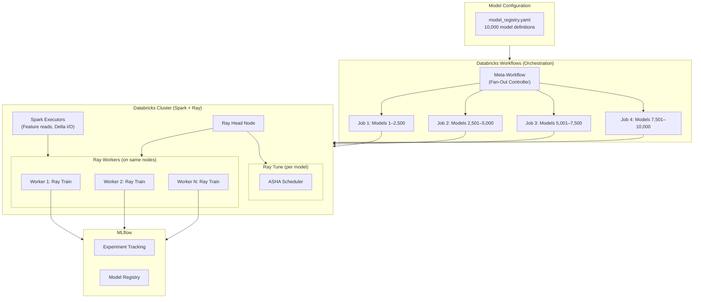

#### How It Works: Ray on Databricks

Databricks clusters natively support both Spark and Ray. On any Databricks cluster, Ray workers can be launched on the same Spark executor nodes:

```python
# On a Databricks cluster — Ray runs alongside Spark on the same nodes
from ray.util.spark import setup_ray_cluster

ray_cluster = setup_ray_cluster(
    num_worker_nodes=20,
    num_cpus_per_node=8,
    num_gpus_per_node=0,          # CPU-only for tree models
    collect_log_to_path="/dbfs/ray_logs/"
)
```

There is no separate Ray infrastructure to provision. The cluster policies, instance pools, spot fallback, and auto-scaling defined in Terraform apply to both Spark and Ray workloads identically.

#### Hyperparameter Tuning with Ray Tune

Ray Tune provides the distributed hyperparameter search for each model. The ASHA scheduler (Asynchronous Successive Halving Algorithm) early-terminates underperforming trials, saving ~35% of HPO compute compared to exhaustive grid or random search:

```python
from ray import tune
from ray.tune.schedulers import ASHAScheduler
from ray.air.integrations.mlflow import MLflowLoggerCallback

def train_model(config):
    """Single trial: train one model with one hyperparameter set."""
    import xgboost as xgb
    from sklearn.model_selection import cross_val_score

    model = xgb.XGBClassifier(
        max_depth=config["max_depth"],
        learning_rate=config["learning_rate"],
        n_estimators=config["n_estimators"],
        subsample=config["subsample"],
        use_label_encoder=False,
        eval_metric="logloss",
    )

    X_train, y_train = load_features_for_model(config["model_id"])
    scores = cross_val_score(model, X_train, y_train, cv=5, scoring="roc_auc")
    tune.report(roc_auc=scores.mean(), roc_auc_std=scores.std())


tuner = tune.Tuner(
    train_model,
    param_space={
        "model_id": "clf_us_retail_conversion",
        "max_depth": tune.choice([3, 5, 7, 9]),
        "learning_rate": tune.loguniform(0.001, 0.3),
        "n_estimators": tune.choice([100, 300, 500, 800]),
        "subsample": tune.uniform(0.6, 1.0),
    },
    tune_config=tune.TuneConfig(
        scheduler=ASHAScheduler(
            metric="roc_auc",
            mode="max",
            max_t=100,
            grace_period=10,
            reduction_factor=3,
        ),
        num_samples=30,                # 30 trials per model
    ),
    run_config=tune.RunConfig(
        callbacks=[
            MLflowLoggerCallback(      # Auto-logs to shared MLflow
                experiment_name="mlops-platform-training",
                tracking_uri="databricks",
            )
        ],
    ),
)

results = tuner.fit()
best_result = results.get_best_result(metric="roc_auc", mode="max")
```

**Why Ray Tune is the natural fit for HPO at this scale:**

| Capability | What It Does | Why It Matters at 10K Models |
|---|---|---|
| **ASHA Scheduler** | Early-terminates bad trials at 1/3 training time | Saves ~35% of HPO compute — critical at 10K × 30 trials |
| **Population-Based Training** | Mutates hyperparameters during training | Finds optima faster for complex search spaces |
| **Bayesian Optimisation** | Learns from prior trials to focus search | Reduces required trials from 100+ to 20–30 per model |
| **Fractional Resources** | Allocates 0.5 CPU per trial if needed | Pack more trials per node — better cluster utilisation |
| **MLflow Callback** | Auto-logs every trial to MLflow | No custom logging code; all 300K+ trials (10K × 30) tracked |
| **Fault Tolerance** | Checkpoints trial state, resumes on failure | Individual trial failure doesn't lose work |

#### Training Orchestration: Hierarchical Fan-Out

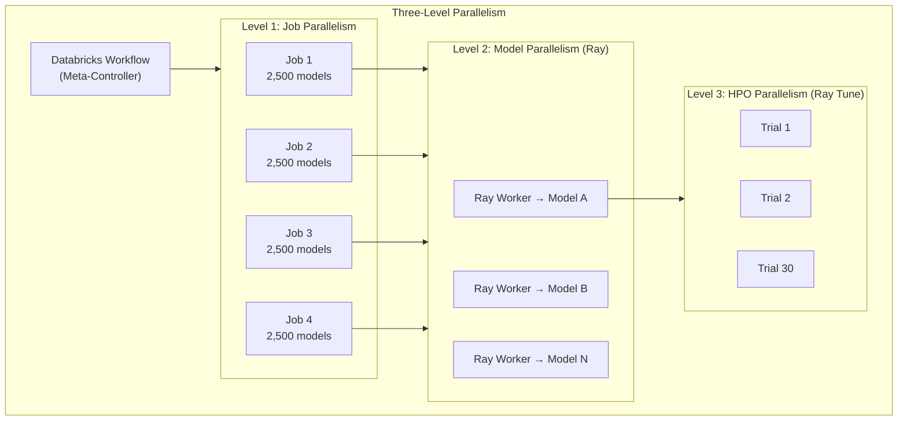

| Level | Mechanism | Parallelism |
|---|---|---|
| **Job-Level** | Databricks Workflows — 4 parallel task groups | 4 concurrent jobs × 2,500 models each |
| **Model-Level** | Ray Train workers — each worker trains one model | 50–100 models concurrently per job |
| **HPO-Level** | Ray Tune ASHA — distributed search per model | 4–8 concurrent trials per model |

**Why 2,500 models per job?** Running 10,000 individual Databricks jobs creates excessive overhead: cluster startup (3–8 min each = 500–1,300 hours wasted), API rate limits, and orchestration complexity. Batching 2,500 models per job amortises cluster startup cost and keeps orchestration within Databricks' concurrent job limits.

**Model Training Framework Selection:**

| Model Type | Framework | Why |
|---|---|---|
| Classification (binary/multi) | **XGBoost** | Dominates tabular data benchmarks, native Ray Train integration |
| Regression | **LightGBM** | Memory-efficient, faster on high-feature-count data |
| Clustering/Segmentation | **scikit-learn** KMeans | < 10M records fits single node; Ray Train coordinates |
| Future: Deep Learning | **PyTorch** | Multi-GPU via Ray Train `TorchTrainer` when needed |

**Why tree-based models (XGBoost/LightGBM) over deep learning?** This is a tabular data problem. Tree ensembles consistently match or beat deep learning on structured data (Grinsztajn et al. 2022). XGBoost predicts at ~100K–300K records/sec/core vs. ~1K–10K for neural networks — at 7.5 trillion predictions, that's the difference between hours and weeks. Tree models are also inherently interpretable (feature importance), smaller to store (10–500MB vs. GB-scale), and CPU-only (no GPU cost).

#### Champion/Challenger Quality Gate

No model reaches production without passing automated quality gates:

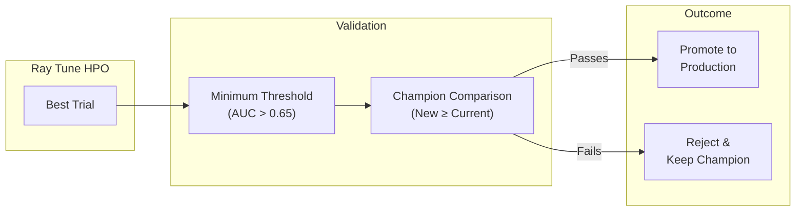

1. **Minimum threshold**: The new model must exceed absolute minimums (e.g., AUC ≥ 0.65 for classifiers, R² ≥ 0.30 for regressors).
2. **Non-regression**: The new model must match or beat the current champion on the primary metric.
3. **Multi-metric check**: Secondary metrics (precision, recall, F1) must not regress by more than 2%.
4. **Promotion**: Passing models are registered in MLflow with stage `Production`. Failing models are logged for analysis.

**Training Time Estimates:**

| Component | Estimate |
|---|---|
| Feature retrieval per model (Spark → Delta Lake) | 30–60 seconds |
| HPO (30 trials, ASHA early stopping) | 8–15 minutes |
| Model registration + validation (MLflow) | 1–2 minutes |
| **Total per model** | ~12–22 minutes |
| **2,500 models per job (50–100 concurrent via Ray)** | ~2–4 hours |
| **4 parallel jobs (Databricks Workflows)** | **~2–4 hours total** |

---

### 1c. Batch Inference

Scoring 750 million records for each of 10,000 models — 7.5 trillion total predictions — inside a 24-hour window is the hardest scaling challenge. The architecture uses **Spark for data I/O** (reading the universe, writing results) and **Ray Actors for stateful model scoring** (holding models in memory across batches).

#### Why Stateful Scoring?

The naïve approach — load a model, broadcast it, score, unload, repeat 10,000 times — wastes time on repeated model serialisation and network transfer. Each model is 10–500MB; broadcasting to 50+ executor nodes means 500MB–25GB of network traffic per model, repeated 10,000 times.

Ray Actors solve this by keeping models loaded in memory as long-lived Python objects. When a model finishes scoring its 750M records, the actor swaps to the next model locally — no broadcast, no repeated deserialisation.

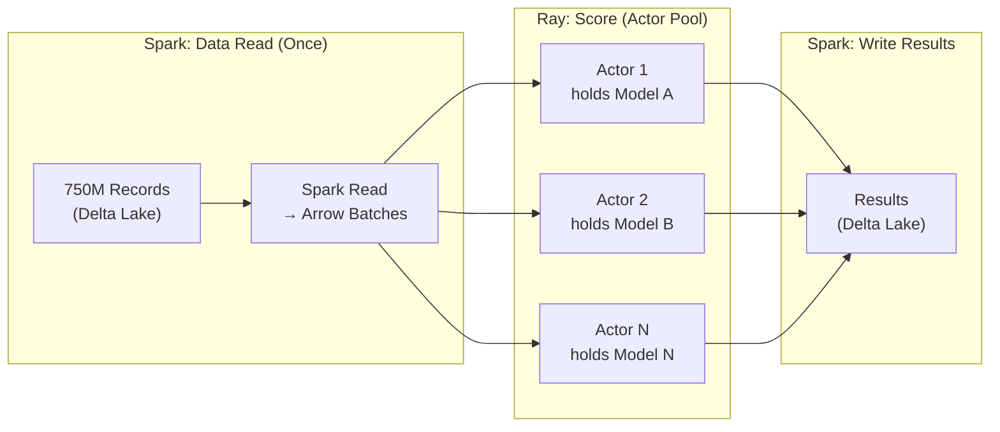

**"Read Once, Score Many"**: The 750M-record universe is read from Delta Lake via Spark (leveraging Delta Cache, Z-ordering, and column pruning), converted to Arrow batches, and streamed to Ray Actors. Each actor holds one model and scores all data partitions assigned to it. Results are written back to Delta Lake via Spark.

#### Inference Architecture

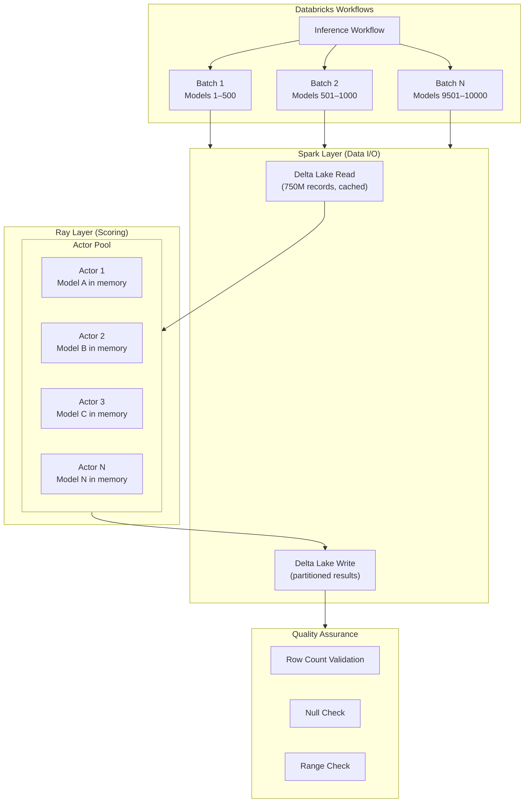

#### Ray Actor Implementation

```python
import ray
import mlflow
import numpy as np

@ray.remote(num_cpus=2, max_restarts=3)
class ModelScoringActor:
    """
    Stateful Ray Actor that holds a model in memory.

    - Model loaded once, stays in memory across all data batches
    - Automatic restart on failure (max_restarts=3)
    - Dynamic CPU allocation per actor
    """

    def __init__(self, model_id: str, run_id: str):
        self.model_id = model_id
        self.model = mlflow.pyfunc.load_model(f"runs:/{run_id}/model")
        self.records_scored = 0

    def score_batch(self, data_batch: np.ndarray, feature_names: list) -> dict:
        """Score a batch of records against the held model."""
        import pandas as pd
        df = pd.DataFrame(data_batch, columns=feature_names)
        predictions = self.model.predict(df)
        self.records_scored += len(predictions)
        return {
            "model_id": self.model_id,
            "predictions": predictions,
            "count": len(predictions),
        }

    def swap_model(self, new_model_id: str, new_run_id: str):
        """Swap to a different model without destroying the actor."""
        del self.model
        self.model_id = new_model_id
        self.model = mlflow.pyfunc.load_model(f"runs:/{new_run_id}/model")
        self.records_scored = 0

    def get_stats(self) -> dict:
        return {"model_id": self.model_id, "records_scored": self.records_scored}
```

**Model lifecycle within actors:**
1. Actor starts, loads Model A from MLflow → model is in memory.
2. Data partitions (~5M records each) are streamed to the actor via Ray object store.
3. Actor scores all 150 partitions (750M / 5M) for Model A.
4. Actor calls `swap_model()` — releases Model A, loads Model B. No new actor creation.
5. Repeat until all assigned models are scored.

#### Throughput Analysis

| Parameter | Value |
|---|---|
| XGBoost predict throughput (1K features, 1 core) | ~100K–300K records/sec |
| Actors per inference job | 50–100 |
| Actor pool throughput (100 actors × 2 cores) | ~20–60M records/sec |
| Time per model (750M records) | ~12–37 seconds |
| Models per batch job (500 models) | ~1.7–5.2 hours |
| Parallel batch jobs (Databricks Workflows) | 20 |
| **Total inference wall-clock** | **~1.7–5.2 hours** |

Comfortable buffer under the 24-hour SLA, with capacity to absorb feature computation overhead and retries.

#### Data Transfer: Spark ↔ Ray

Data flows between Spark and Ray using Apache Arrow for zero-copy transfer within the same cluster:

```python
# Option 1: Spark DataFrame → Arrow → Ray Dataset (same-node zero-copy)
import ray.data
spark_df = spark.read.format("delta").load("s3://bucket/gold/features")
ray_dataset = ray.data.from_spark(spark_df)

# Option 2: Ray reads Delta Lake directly (for simpler pipelines)
ray_dataset = ray.data.read_delta("s3://bucket/gold/features")
```

Since Spark and Ray run on the same nodes, Arrow-based transfer avoids network I/O entirely for co-located data.

---

## 2. Technology Stack

### Complete Technology Stack

| Category | Choice | Justification |
|---|---|---|
| **Platform** | **Databricks Lakehouse** | Unified compute, storage, MLOps, governance. Eliminates tool sprawl. Supports both Spark and Ray natively. |
| **Storage** | **Delta Lake** (on S3/ADLS/GCS) | ACID transactions, time travel (reproducibility), Z-ordering, schema evolution. Parquet-compatible. |
| **Data Processing** | **PySpark** | Distributed DataFrame engine for ingestion, transforms, SQL, feature pipelines. Photon-accelerated. |
| **ML Training** | **Ray Train** on Databricks | Python-native distributed training, dynamic resource allocation, checkpointing, GPU support. |
| **HPO** | **Ray Tune** on Databricks | ASHA, PBT, Bayesian optimisation, early stopping. Scales to 10K models × 30 trials. |
| **Batch Inference** | **Ray Actors** on Databricks | Stateful model hosting — models stay in memory, no broadcast overhead. |
| **ML Frameworks** | **XGBoost** + **LightGBM** + **scikit-learn** | Tree ensembles dominate tabular data. 100K–300K predictions/sec/core. CPU-only inference. |
| **Feature Store** | **Databricks Feature Store** (Unity Catalog) | Native point-in-time lookups, online store sync, lineage tracking. |
| **Experiment Tracking** | **MLflow** (Databricks-managed) | Zero-setup tracking, model registry (Staging → Production). Auto-logged from Ray Tune. |
| **Monitoring** | **Lakehouse Monitoring** + **Evidently** | Built-in drift detection on Delta tables + custom statistical tests (PSI, KS-test). |
| **Orchestration** | **Databricks Workflows** | Multi-task DAGs with dependencies, retries, timeouts. Orchestrates both Spark and Ray tasks. |
| **IaC** | **Terraform** (Databricks + AWS providers) | Declarative provisioning of clusters, policies, pools, Unity Catalog, secrets, S3. |
| **CI/CD** | **GitHub Actions** + **Databricks Asset Bundles** | PR-triggered testing + native Databricks deployment. |
| **Language** | **Python** (PySpark + Ray) | ML lingua franca. PySpark for data; Ray for AI — both Python-native. |

### Technology Decision Matrix

| Requirement | Chosen | Considered & Why Not |
|---|---|---|
| **Platform** | Databricks Lakehouse | Custom Spark + Airflow + S3: 60–70% more ops overhead. No unified governance. |
| **Storage** | Delta Lake | Raw Parquet: No ACID, no time travel. Iceberg: Less Databricks integration. |
| **ML Frameworks** | XGBoost/LightGBM | PyTorch/TensorFlow: 10–100× slower inference for tabular data, requires GPUs, harder to operationalise at 10K models. |
| **HPO** | Ray Tune | Hyperopt: Limited schedulers (no ASHA/PBT), weaker fault tolerance. Optuna: Good single-node, less native Databricks integration. |
| **Training** | Ray Train | Spark `foreach()`: Fixed executor resources, JVM overhead, no checkpointing. |
| **Inference** | Ray Actors | Spark broadcast: Repeated model deserialisation per model, no stateful caching. |
| **Feature Store** | Unity Catalog FS | Feast: Requires separate infrastructure, no native lineage. |
| **Orchestration** | Databricks Workflows | Airflow: Separate cluster to manage. Kubeflow: Kubernetes complexity. |
| **Model Tracking** | MLflow | W&B: External SaaS, adds cost. DVC: File-centric, no integrated serving. |
| **IaC** | Terraform | Pulumi: Smaller community. CloudFormation: AWS-only. |

---

## 3. Performance & Bottlenecks

### Bottleneck Analysis

| # | Bottleneck | Severity | Root Cause | Mitigation |
|---|---|---|---|---|
| 1 | **Feature Explosion** | 🔴 Critical | 3K raw → 30K features × 750M records = 22.5 trillion cells | Model-specific subsets (1–3K via feature selection) + lazy computation + sparse encoding |
| 2 | **Data Shuffle on Joins** | 🔴 Critical | Joining feature tables with inference universe shuffles 750M rows | Pre-materialised denormalised feature tables + bucketed joins + broadcast small dimensions |
| 3 | **Memory Pressure** | 🟡 Medium | 750M × 3K features × 8 bytes ≈ 18TB in memory | Chunked scoring (~5M per partition), spill-to-disk, Ray's object store manages memory lifecycle |
| 4 | **Model Load Overhead** | 🟢 Low | 10K model deserialisations | Ray Actors — models persist in memory, warm swap between models |
| 5 | **Cluster Cold Start** | 🟡 Medium | 3–8 min startup × 20 clusters = 60–160 min overhead | Instance pools with min idle instances + cluster reuse within workflow |
| 6 | **Storage Throughput** | 🟡 Medium | Reading 750M records repeatedly = massive I/O | Delta Cache (SSD) + Z-ordering on partition keys + column pruning + "Read Once, Score Many" |
| 7 | **API Throttling** | 🟢 Low | 10K model registrations hit rate limits | Ray Tune's `MLflowLoggerCallback` batches logs; async model registration |

### The "Read Once, Score Many" Pattern

This is the single most important optimisation in the inference layer:

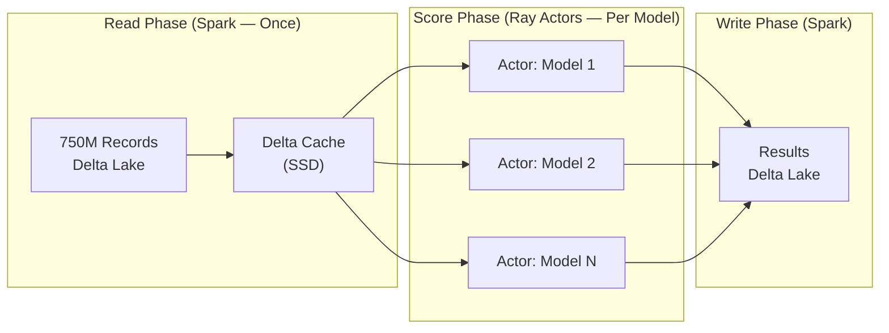

For models sharing the same feature set, the universe data is read once into Delta Cache, then streamed to Ray Actors holding different models. This turns the cost model from `O(records × features × models)` into `O(records × features) + O(records × features_per_model × models)`.

### Pros/Cons of the Design

#### ✅ Advantages

| Advantage | Detail |
|---|---|
| **Unified Platform** | Single Databricks workspace — one set of credentials, one governance layer, one monitoring surface |
| **Delta Lake ACID** | Concurrent reads/writes, time travel for reproducibility, schema evolution for future features |
| **Stateful Inference** | Ray Actors hold models in memory — eliminates broadcast overhead across 10K models |
| **Intelligent HPO** | Ray Tune ASHA early-stops bad trials — ~35% compute savings vs. exhaustive search |
| **GPU-Ready** | Ray natively schedules GPU workloads — ready for deep learning or GenAI without architecture change |
| **Elastic Cost** | Auto-scaling + spot instances + cluster policies = cost proportional to load |
| **Config-Driven** | 10K models managed via YAML config — no code changes per model |

#### ❌ Disadvantages & Limitations

| Disadvantage | Mitigation |
|---|---|
| **Vendor Dependency** | Delta Lake is OSS, MLflow is OSS, Ray is OSS. Data and models remain portable. Abstract Databricks-specific APIs behind interfaces. |
| **Cost at Scale** | DBU pricing on top of cloud compute. Mitigate with spot instances, cluster policies, auto-termination, Photon. |
| **Limited Real-Time** | Optimised for batch. For future RT: Ray Serve for ML models, vLLM for LLMs — both run natively on the same Ray infrastructure. |
| **Cluster Startup Latency** | Instance pools with pre-warmed nodes. Serverless SQL for monitoring queries. |
| **Complexity** | Two compute engines (Spark + Ray) means teams need both skills. Natural role split: data engineers use Spark, ML engineers use Ray. |
| **Demo vs. Production Gap** | Local demo uses Pandas/single-node; production uses PySpark + Ray. Code documents equivalences explicitly. |

#### Proposed Next Steps to Prove the Approach

| # | Step | Purpose | Timeline |
|---|---|---|---|
| 1 | **POC (10 models, 10M records)** | Validate end-to-end pipeline with Ray Tune + Ray Actors | 2 weeks |
| 2 | **Benchmark (100 models, 100M records)** | Measure throughput, cost, compare Spark-only vs. hybrid | 2 weeks |
| 3 | **Stress Test (1,000 models, 750M records)** | Identify 10%-scale bottlenecks | 3 weeks |
| 4 | **Cost Validation** | Compare projected vs. actual DBU costs | Concurrent |
| 5 | **Governance Audit** | Verify lineage, ACLs, audit trail completeness | 1 week |
| 6 | **Full-Scale Pilot** | 10K models production readiness | 4 weeks |

---

## 4. Scalability & Optimization

### Training Scaling

| Scaling Level | Mechanism | Parallelism |
|---|---|---|
| **Job-Level** | Databricks Workflows parallel tasks | 4 concurrent jobs (can scale to 20) |
| **Model-Level** | Ray Train workers on each job's cluster | 50–100 concurrent models per job |
| **HPO-Level** | Ray Tune ASHA — distributed search | 4–8 concurrent trials per model |
| **Data-Level** | Spark partitions for feature retrieval | 10–100 partitions per model's training data |

### Inference Scaling

| Technique | How It Helps |
|---|---|
| **Model-Sharded, Data-Parallel** | Each actor holds one model; data partitions stream through it |
| **Actor Pool with Warm Swaps** | Actors swap models locally — no broadcast, no actor recreation |
| **Delta Cache** | SSD-cached reads mean the 750M-record universe is read once from S3 |
| **Z-Ordering** | Delta Lake Z-ordering on partition keys reduces I/O by 50–80% |
| **Column Pruning** | Read only model-specific features (30 out of 30K) — 1000× I/O reduction |

### Compute Cost Optimization

| Technique | Savings | Implementation |
|---|---|---|
| **Spot Instances** | 60–80% on compute | `SPOT_WITH_FALLBACK` — auto-promotes to on-demand if spot is revoked |
| **ASHA Early Stopping** | ~35% on training HPO | Ray Tune kills underperforming trials at 1/3 of training time |
| **Actor Memory Reuse** | ~20% on inference | No repeated model serialisation across 10K models |
| **Cluster Policies** | Prevent cost overruns | Terraform-defined max workers, allowed instance types, auto-termination |
| **Instance Pools** | Eliminate startup cost | Pre-warmed nodes with min idle instances |
| **Photon Engine** | 2–3× for Delta reads | Vectorised query engine for Spark data I/O |
| **Reserved Instances** | 30–50% for baseline | AWS Reserved Instances for predictable base load |

### Monthly Cost Estimate

| Component | Specification | Monthly Estimate |
|---|---|---|
| Feature Engineering (Spark) | 20 nodes × i3.2xlarge × 2 hrs × 30 days | ~$15,000 |
| Training (Ray on Databricks) | 4 jobs × 25 nodes × i3.2xlarge × 4 hrs × 4 runs/month | ~$20,000 |
| Inference (Ray Actors) | 20 jobs × 40 nodes × c5.4xlarge × 4 hrs × 30 runs/month | ~$42,000 (post-spot) |
| Databricks DBUs | ~840K DBUs/month (Jobs + Ray Compute) | ~$125,000 |
| Storage (Delta Lake on S3) | ~500TB | ~$11,500 |
| Instance Pools (Idle) | 50 idle instances 24/7 | ~$15,000 |
| Monitoring & Dashboards | SQL Serverless + alerting | ~$5,000 |
| Networking | Cross-AZ, S3 transfer, Spark↔Ray Arrow | ~$3,500 |
| **Total** | | **~$237,000/mo** |
| **Per Model** | 10,000 models | **~$23.70/model/month** |

> $237K/month for 10,000 models running 7.5 trillion daily predictions = ~$23.70 per model per month. A single data scientist costs $15K+/month — the platform replaces manual model management for thousands of models.

---

## 5. Governance & Compliance

Unity Catalog is the governance backbone — it operates at the catalog/schema/table level, agnostic to whether data was processed by Spark, Ray, or SQL.

### Reproducibility Architecture

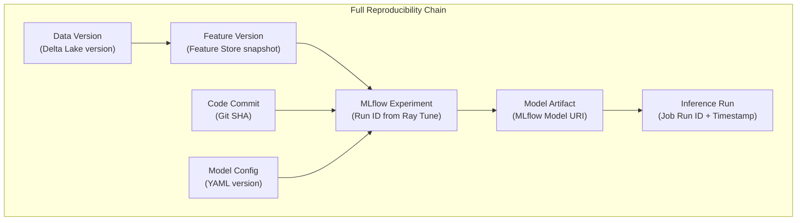

| Dimension | Mechanism |
|---|---|
| **Data Versioning** | Delta Lake time travel — `versionAsOf` / `timestampAsOf` |
| **Feature Versioning** | Feature Store snapshots, point-in-time lookups |
| **Code Versioning** | Git SHA logged with every MLflow run via CI/CD |
| **Config Versioning** | `model_registry.yaml` in Git, changes via PR review |
| **Model Versioning** | MLflow Registry: None → Staging → Production → Archived |
| **Experiment Tracking** | MLflow — auto-logged from Ray Tune for every trial |
| **Environment Versioning** | `requirements.txt` + `pyproject.toml` + Docker image |
| **Data Hashing** | SHA-256 hash of training data snapshot logged per run |

### Access Controls (RBAC)

Unity Catalog grants managed via Terraform:

| Role | Privileges | Purpose |
|---|---|---|
| **ML Engineer** | USE_CATALOG, USE_SCHEMA, SELECT, MODIFY, CREATE_TABLE, CREATE_FUNCTION | Full pipeline management |
| **Data Scientist** | USE_CATALOG, USE_SCHEMA, SELECT, CREATE_TABLE | Read data, create experiments |
| **Auditor** | USE_CATALOG, USE_SCHEMA, SELECT | Read-only audit access |
| **Service Principal** | Full ML Engineer privileges | Automated pipeline execution |

### Compliance

| Standard | Implementation |
|---|---|
| **GDPR** | Right to erasure via Delta `DELETE` + `VACUUM`. Data minimisation via Feature Store. |
| **CCPA** | Unity Catalog search by user ID. Opt-out via inference exclusion lists. |
| **HIPAA** | KMS encryption at rest, TLS 1.3 in transit. BAA with Databricks + cloud provider. |
| **SOX** | Model approval workflows — staging → production requires authorised promotion. Separation of duties via RBAC. |

### Feature Space Changes

| Scenario | Handling |
|---|---|
| **New feature added** | Add to feature pipeline, register in Feature Store, update model configs that use it, retrain affected models |
| **Feature retired** | Mark deprecated in Feature Store, remove from model configs, retrain affected models, archive historical data |
| **Feature definition changed** | Version the feature (e.g., `revenue_30d_v2`), maintain backward compatibility, gradual migration |
| **Feature drift detected** | Lakehouse Monitoring flags via PSI/KS-test, alert triggers investigation, retrain if confirmed |

### Secrets Management

Databricks Secret Scopes backed by cloud KMS — credentials never hardcoded:

```hcl
resource "databricks_secret_scope" "ml_platform" { name = "ml-platform" }
resource "databricks_secret" "slack_webhook"     { ... }
resource "databricks_secret" "pagerduty_key"     { ... }
```

### Data Lifecycle Management

S3 bucket lifecycle rules managed in Terraform:
- **Bronze data**: Transition to Glacier after 90 days (audit retention)
- **Monitoring reports**: Expire after 365 days (cost management)

---

## 6. Automation & CI/CD

### CI/CD Pipeline

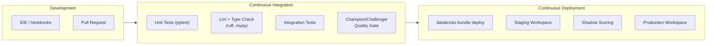

| CI/CD Job | What It Does | Trigger |
|---|---|---|
| **Lint & Type Check** | Ruff linter + formatter + MyPy type checking | Every PR and push to main |
| **Unit Tests** | pytest across Python 3.10/3.11/3.12 with coverage | Every PR and push to main |
| **Docker Build** | Build + push to GitHub Container Registry | Push to main (after tests pass) |
| **Deploy to Databricks** | `databricks bundle validate` + `deploy` to target env | Push to main or manual dispatch |
| **Terraform Plan** | `terraform validate` + `plan` to preview infra changes | PR only |

### Retraining Triggers

| Trigger | Condition | Response |
|---|---|---|
| **Scheduled** | Weekly/monthly cron | Full retraining for all 10K models via Databricks Workflow |
| **Data Drift** | Lakehouse Monitoring PSI > 0.2 | Targeted retraining of affected models |
| **Performance Drop** | Business KPI below threshold | Emergency retraining with expanded HPO |
| **New Data Source** | New feature added | Retraining with updated feature set |

### Self-Service Model Deployment

A data scientist deploys a new model by:
1. Develop in Databricks notebook or IDE with MLflow tracking
2. Add a YAML config entry to `model_registry.yaml`
3. Submit a PR — CI automatically tests and validates
4. ML engineer reviews and approves
5. `databricks bundle deploy` includes the model in the next pipeline run

No custom infrastructure knowledge required.

### Model Ensembles & Dependencies

Model-to-model dependencies are declared in config and resolved by the orchestration layer:

```yaml
models:
  - model_id: "clust_customer_segments"
    depends_on: []                          # No dependencies — runs first

  - model_id: "clf_segment_propensity"
    depends_on: ["clust_customer_segments"] # Uses segment output as feature
```

Databricks Workflows resolves the dependency DAG and executes in topological order. Intermediate outputs are materialised to Delta Lake and consumed as features by downstream models.

---

## 7. Monitoring & Observability

### Drift Detection at Scale

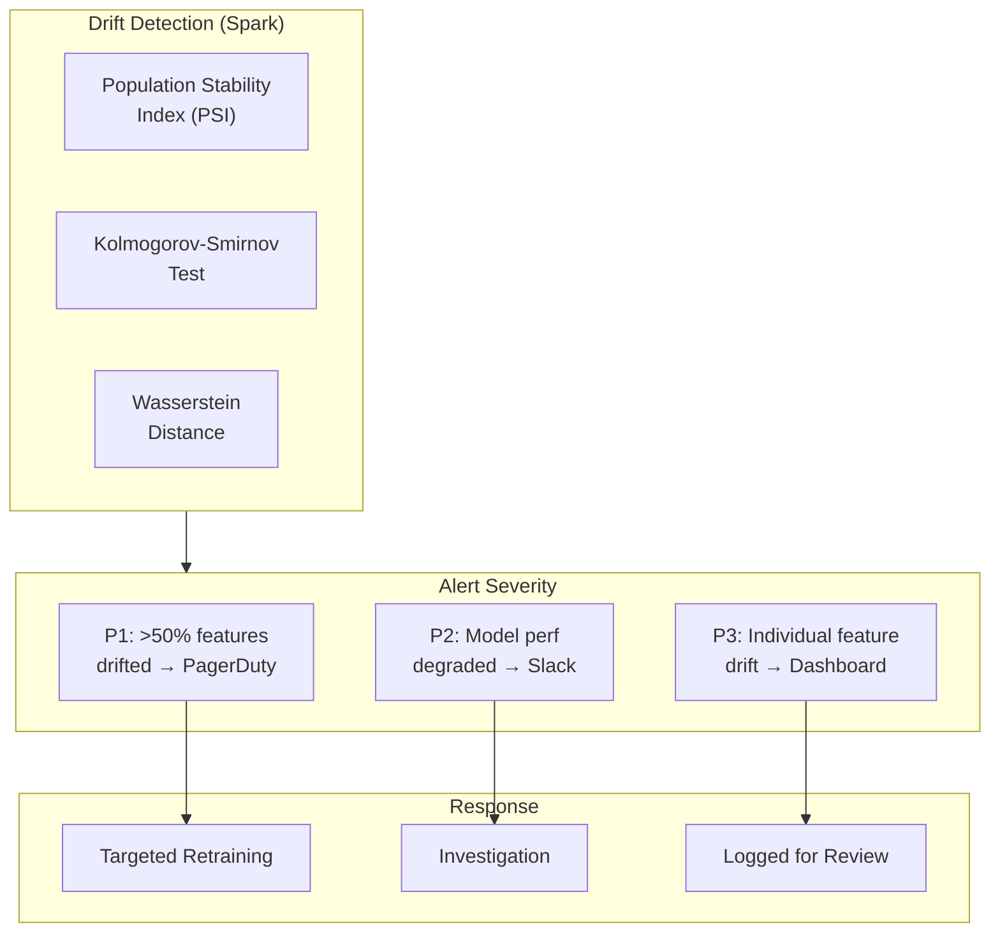

| Drift Type | Detection Method | Tool | Threshold |
|---|---|---|---|
| **Feature Drift** | PSI per feature | Lakehouse Monitoring | PSI > 0.2 |
| **Concept Drift** | KS test on predictions | Evidently | p-value < 0.05 |
| **Prediction Drift** | Wasserstein distance | Lakehouse Monitoring | > 2σ from baseline |
| **Data Quality** | Null rate, cardinality | DLT expectations | Null > 10%, cardinality change > 20% |

### Alerting System

| Severity | Condition | Channel | Response |
|---|---|---|---|
| **P1** (Critical) | >50% features drifted or model AUC dropped >10% | PagerDuty → on-call engineer | Immediate investigation + emergency retraining |
| **P2** (Warning) | Individual model performance degraded | Slack `#ml-alerts` | Investigate within 24 hours |
| **P3** (Info) | Individual feature drift detected | Dashboard / weekly report | Review in next planning cycle |

### Business Observability

For non-technical stakeholders:

| Metric | Visualisation | Update Frequency |
|---|---|---|
| Model health scorecard | Databricks SQL Dashboard | Daily |
| Prediction volume by segment | SQL Dashboard with drill-down | Hourly |
| Cost per model | Databricks billing tags + Dashboard | Weekly |
| Data freshness | Delta table modification timestamps | Daily |
| Model accuracy trends | MLflow metric plots embedded in Dashboard | Per retraining |

### Performance Logging & Telemetry

| Layer | Metric | Tool |
|---|---|---|
| **Infrastructure** | CPU, memory, disk, network | Databricks Ganglia / CloudWatch |
| **Spark** | Stage duration, shuffle, spill, I/O | Spark UI + Databricks query profiler |
| **Ray** | Worker utilisation, object store memory, task latency | Ray Dashboard (embedded in Databricks) |
| **ML** | Training loss curves, evaluation metrics, prediction distributions | MLflow + Lakehouse Monitoring |
| **Pipeline** | Job duration, success rate, SLA compliance | Databricks Workflows metrics |

---

## 8. Future: Real-Time Capabilities

The architecture naturally extends to real-time workloads through the same Ray infrastructure already in place for batch inference.

### Online Learning / Incremental Updates

| Approach | Implementation |
|---|---|
| **Micro-batch retraining** | Reduce batch window from daily to hourly; same pipeline, shorter trigger |
| **Incremental feature updates** | Delta Lake change data feed (CDF) + streaming feature computation |
| **Warm-start training** | Load previous model weights, train on new data only (supported by XGBoost/LightGBM) |

### Low-Latency Real-Time Inference

For models requiring < 100ms inference latency, Ray Serve provides autoscaling model endpoints:

```python
from ray import serve

@serve.deployment(
    num_replicas=3,
    ray_actor_options={"num_cpus": 2},
    autoscaling_config={
        "min_replicas": 1,
        "max_replicas": 10,
        "target_num_ongoing_requests_per_replica": 5,
    },
)
class ModelEndpoint:
    def __init__(self, model_id: str):
        self.model = mlflow.pyfunc.load_model(f"models:/{model_id}/Production")

    async def __call__(self, request):
        features = await request.json()
        prediction = self.model.predict(features)
        return {"model_id": model_id, "prediction": prediction.tolist()}

app = ModelEndpoint.bind(model_id="clf_us_retail_conversion")
serve.run(app, route_prefix="/predict")
```

This runs on the same Databricks/Ray infrastructure — no separate serving cluster needed.

### GenAI / LLM Support

If the platform needs to serve LLMs (Llama, Mistral, DeepSeek), embedding models, or rerankers in the future, **vLLM** runs natively on Ray:

```python
from vllm import LLM, SamplingParams

llm = LLM(
    model="meta-llama/Llama-3.1-8B-Instruct",
    tensor_parallel_size=4,       # Multi-GPU
    dtype="bfloat16",
)
outputs = llm.generate(prompts, SamplingParams(temperature=0.7, max_tokens=512))
```

This requires no architecture change — vLLM is a Ray application. The same cluster policies, governance (Unity Catalog), and monitoring (Lakehouse Monitoring) apply. The platform evolves from batch ML to GenAI as a capability addition, not a rewrite.

### Adaptation Path

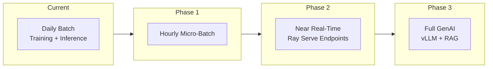

Each phase is an extension of the existing architecture — same platform, same governance, same monitoring, additional capabilities.

---

## Appendix A: Project Structure (Demo Implementation)

The demo implementation runs end-to-end locally, proving the architecture patterns at small scale. Production equivalences are documented in every module's docstring.

```
mlops_pipeline/
├── config/
│   ├── pipeline_config.yaml          # Pipeline behaviour config
│   └── model_registry.yaml           # 10 demo models (10K in production)
├── src/
│   ├── data_ingestion.py             # Synthetic data gen (Auto Loader in prod)
│   ├── feature_engineering.py        # Two-phase feature strategy (PySpark in prod)
│   ├── model_training.py             # HPO + MLflow (Ray Tune/Train in prod)
│   ├── batch_inference.py            # Chunked scoring (Ray Actors in prod)
│   ├── model_monitoring.py           # PSI, KS-test, Evidently
│   └── utils.py                      # Config, logging, hashing, I/O
├── orchestration/
│   ├── pipeline_runner.py            # Local end-to-end runner
│   └── databricks_workflow.json      # Production Databricks DAG
├── infrastructure/terraform/
│   ├── main.tf                       # Unity Catalog, policies, pools, S3
│   ├── variables.tf                  # Parameterised config
│   └── outputs.tf                    # Resource IDs
├── databricks/
│   ├── databricks.yml                # Asset Bundle config (dev/staging/prod)
│   └── notebooks/                    # Databricks notebook entry points
├── tests/
│   ├── test_feature_engineering.py   # 10 tests for feature pipeline
│   └── test_model_training.py        # 8 tests for model training
├── .github/workflows/ci-cd.yml      # 5-job CI/CD pipeline
├── Dockerfile                        # Multi-stage build
├── docker-compose.yml                # Local dev: pipeline + MLflow + tests
├── Makefile                          # 18 targets for dev/deploy/terraform
└── pyproject.toml                    # Package config
```

---

## Appendix B: Databricks Workflow Definition

The production pipeline is defined as a multi-task Databricks Workflow with task dependencies:

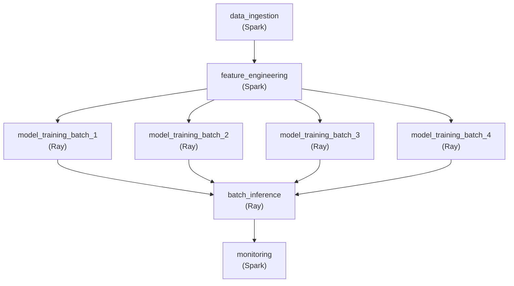

| Task | Cluster | Timeout | Retries | Purpose |
|---|---|---|---|---|
| `data_ingestion` | Feature engineering cluster | 1 hour | 2 | Ingest raw data into Bronze |
| `feature_engineering` | Feature engineering cluster | 2 hours | 2 | Transform features into Gold |
| `model_training_batch_1–4` | Training cluster (Spark + Ray) | 8 hours | 1 | Train 2,500 models each via Ray |
| `batch_inference` | Inference cluster (Spark + Ray) | 24 hours | 2 | Score 750M records × 10K models via Ray Actors |
| `monitoring` | Monitoring cluster | 1 hour | 1 | Drift detection, quality checks, alerting |

**Cluster Configurations:**

| Cluster | Node Type | Workers | Features |
|---|---|---|---|
| **Feature Engineering** | i3.2xlarge | 5–50 (autoscale) | Photon, Delta auto-compact, spot fallback |
| **Training** | i3.2xlarge | 10–50 (autoscale) | ML Runtime, Ray enabled, spot fallback |
| **Inference** | c5.4xlarge (compute-optimised) | 20–100 (autoscale) | Photon, Ray enabled, spot fallback |
| **Monitoring** | m5.xlarge | 2 (fixed) | Minimal — Spark SQL queries only |

All clusters use `SPOT_WITH_FALLBACK` availability, instance pools with pre-warmed nodes, and Terraform-managed cluster policies for cost guardrails.

---

## Appendix C: Fault Tolerance Summary

| Failure Mode | Mitigation | Recovery Time |
|---|---|---|
| **Spot instance revocation** | Auto-fallback to on-demand (`SPOT_WITH_FALLBACK`) | ~30 seconds |
| **Individual model training failure** | Catch-and-continue; failed models logged, others proceed | Immediate |
| **Ray actor crash** | `max_restarts=3` — actor auto-restarts, resumes from last partition | ~5 seconds |
| **Inference job crash** | Checkpointed progress — completed models survive in Delta Lake | ~2 minutes (retry) |
| **Data corruption** | Delta Lake time travel — roll back to any prior version | Minutes |
| **Job-level failure** | Automatic retries (`max_retries: 2`) with exponential backoff | ~5 minutes |
| **Task dependency failure** | DAG stops downstream tasks; partial results preserved | Manual intervention |
| **Duplicate predictions** | Idempotent writes via Delta Lake partition-overwrite | N/A (prevented) |
